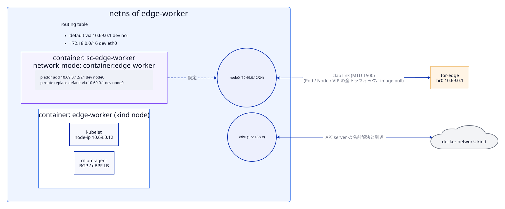
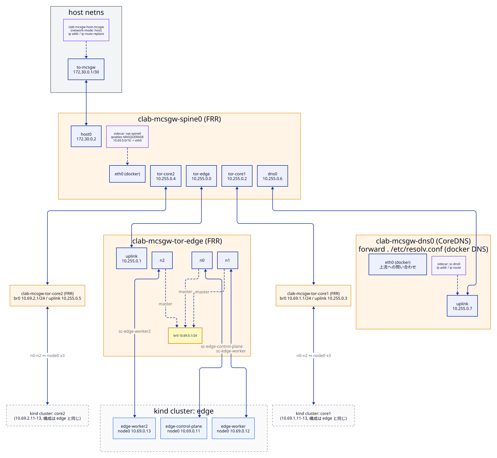
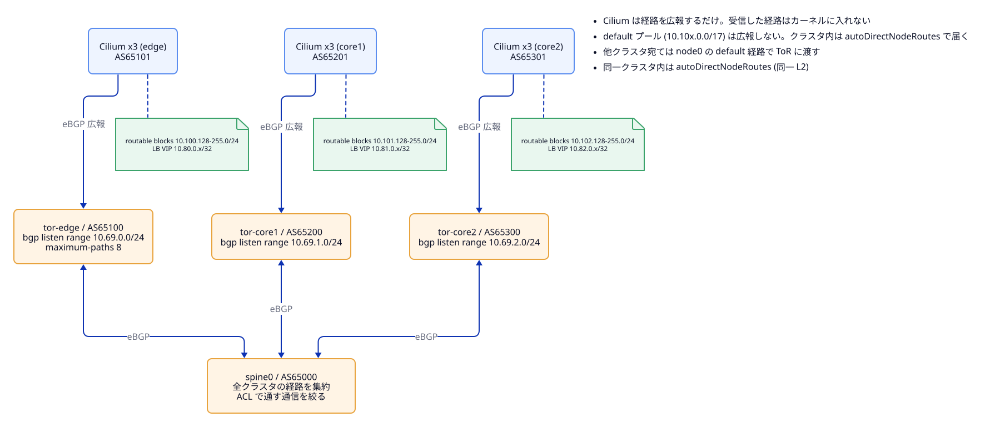

# ネットワーク（containerlab / kind / FRR）

- ステータス: `Draft`
- テストラベル: `fabric`
- 関連: [cilium.md](cilium.md)（Cilium 側の BGP）、[operations.md](operations.md)（起動手順）

## 1. 概要

containerlab のトポロジ 1 つ（lab 名 `mcsgw`）の中に、次のものを置く。

- kind クラスタ 3 つ（`edge`、`core1`、`core2`。各 1 control-plane + 2 worker）
- FRR の spine 1 台（`spine0`）と ToR 3 台（`tor-edge`、`tor-core1`、`tor-core2`）
- 各 kind ノードの sidecar と、spine の NAT 用の sidecar（`nat-spine0`）
- host への veth と、host 側の IP と経路を設定するコンテナ（`host-mcsgw`）
- DNS リゾルバ `dns0`（2.8）

spine0 を外部（host）とクラスタ間の境界とみなし、通す通信を ACL で絞る（2.9。PR 04）。

ネットワークは spine/ToR の 2 段で、全区間を eBGP でつなぐ。1 クラスタに 1 ToR を割り当て、クラスタ内のノードは ToR の L2 bridge（`br0`）にぶら下がる。

---

## 2. 設計

### 2.1 kind クラスタと containerlab の統合

- 各クラスタを containerlab の `k8s-kind` ノード（`startup-config: kind/<cluster>.kind.yaml`）として定義する。containerlab が kind クラスタを作る [L-1]。
  - containerlab v0.82.0 は kind v0.33.0 をライブラリとして組み込んでいる（aqua の kind と同じ版） [L-11]。クラスタを作るのは containerlab で、kind の CLI は kubeconfig の書き出しにだけ使う。
  - ノードのイメージは `k8s-kind` ノードの `image` に digest 付きで書く（`kindest/node:v1.36.4@sha256:...`）。
  - `wait: 0s` を指定する。既定では Ready になるまで最大 15 分待つが、CNI がないのでノードは Ready にならない。
  - `kubeconfig: kubeconfig` を指定し、kind が書く kubeconfig をラボのディレクトリ（`clab-mcsgw/<cluster>/kubeconfig`）に置く。containerlab は root で動くので、指定しないと root の `~/.kube/config` が書き換わる。相対パスはノードのラボディレクトリ（`clab-mcsgw/<cluster>/`）を基準に解決される（containerlab v0.82.0 の `k8s_kind.go` [L-11]）。
  - containerlab v0.82.0 では、これらはノード定義の直下のキー（`wait`、`kubeconfig`）として書く。neco-apps-lite の `extras.k8s_kind.deploy.wait` は古い書き方なので使わない。
- kind が作るノードコンテナ（`<cluster>-control-plane`、`<cluster>-worker`、`<cluster>-worker2`）は、`ext-container` として定義する。こうするとリンクの端点に使える [L-2]。neco-apps-lite と同じ方式 [I-2]。
- 各 kind ノードには sidecar（`kind: linux`、`network-mode: container:<kind ノード名>`）を置く [L-4]。ToR とのリンクはこの sidecar に張り、kind ノードの netns に `node0` を生やす。sidecar の `exec` で次を設定する。
  ```
  ip addr add <node IP>/24 dev node0
  ip route replace default via <ToR GW> dev node0
  ```
  - sidecar のイメージは `nicolaka/netshoot:v0.16` [L-10]。netshoot の既定のコマンド（`zsh`）は端末がないとすぐ終わるので、`cmd: sleep infinity` で動かし続ける（`nat-spine0`、`host-mcsgw` も同じ）。kind ノードと netns を共有するので、テストの `ping`、`curl`、`tcpdump`（PR 05）も sidecar の中で実行する。kindest/node のイメージに入っているツールに頼らないため。
- `eth0`（docker の `kind` ネットワーク）は、API server の名前解決と到達にだけ使う。ノード、Pod、VIP の通信と、イメージの pull はすべて `node0` 経由になる。



トポロジ全体のリンクとインターフェース:



### 2.2 kind の設定

各 `kind/<cluster>.kind.yaml` の内容 [K-1][I-3]:

- `networking.disableDefaultCNI: true`
- `networking.kubeProxyMode: none`
- `networking.podSubnet` と `networking.serviceSubnet` は 3 章の値にする。
- ノードごとの `kubeadmConfigPatches` で、kubelet の `node-ip` を `node0` のアドレスに固定する。これで Node の `INTERNAL-IP` が 10.69.x.x になる。
- control-plane の `localAPIEndpoint.advertiseAddress` は指定しない。API server と etcd は kind の既定どおり `eth0`（docker の `kind` ネットワーク）のアドレスを使う。
  - kind がクラスタを作る時点では、node0 はまだない（sidecar は kind がクラスタを作り終えてから作られる）。`advertiseAddress` に node0 の IP を指定すると、etcd がそのアドレスで待ち受けられずに起動せず、`kubeadm init` が失敗する（`bind: cannot assign requested address`）。実際に試して確かめた。
  - kubelet は `node-ip` のアドレスがなくてもエラーを出しながら動き続け、node0 に IP が付くと Node の `INTERNAL-IP` をそのアドレスにする。これも試して確かめた。それまでの間、Node のアドレスは空になる。
  - API server を `eth0` で使うのは、2.1 の「`eth0` は API server の名前解決と到達にだけ使う」と一致する。`default/kubernetes` の Endpoint は `eth0` のアドレス（172.18.0.x）になる。

kind v0.33.0 は、Kubernetes 1.36 以降には kubeadm の `v1beta4` の設定を作る。`v1beta4` では `kubeletExtraArgs` が `name` と `value` のリストになる。kind は patch の `kubeletExtraArgs` を名前でマージするので、patch は `apiVersion` を書かずにリストの形で書く（kind v0.33.0 の `pkg/internal/patch` で確認した [K-4]）。

```yaml
nodes:
  - role: control-plane
    kubeadmConfigPatches:
      - |
        kind: InitConfiguration
        nodeRegistration:
          kubeletExtraArgs:
            - name: node-ip
              value: "10.69.0.11"
  - role: worker
    kubeadmConfigPatches:
      - |
        kind: JoinConfiguration
        nodeRegistration:
          kubeletExtraArgs:
            - name: node-ip
              value: "10.69.0.12"
```

- neco-apps-lite のノードの patch は、`kubeletExtraArgs` を `v1beta3` の map の形（`node-ip: "..."`）で書いている。`v1beta4` ではリストの形なので、そのままでは使えない。また、`ClusterConfiguration` の patch には `apiVersion: kubeadm.k8s.io/v1beta3` を書いている。kind は `apiVersion` が一致しない patch を当てないので、Kubernetes 1.36 で同じ書き方をすると、その patch は黙って無視される。

### 2.3 FRR

- イメージは `quay.io/frrouting/frr:10.7.1`。このイメージは既定で bgpd が無効で、`frr.conf` も `vtysh.conf` もない。そのため、次の 3 つを `binds` でマウントする。
  - `frr/daemons` → `/etc/frr/daemons`（`bgpd=yes`。全ルータで共通）
  - `frr/vtysh.conf` → `/etc/frr/vtysh.conf`（全ルータで共通）
  - `frr/<router>.conf` → `/etc/frr/frr.conf`
- ルータは `frr defaults datacenter` にする（BGP のタイマーが短く、テストで収束を待つ時間が短くなる）。
- **ToR**:
  - Linux bridge `br0` に GW アドレス（.1）を持たせ、ノード向けの IF（`n0`〜`n2`）を `br0` に入れる [I-2]。containerlab の `exec` で作る。
  - ノードは動的ネイバー（`bgp listen range <node subnet> peer-group NODES`、`remote-as external`）として eBGP で受ける [F-1]。セッションが張られるのは Cilium の BGP を入れる PR 04 から。
  - spine とは eBGP で張る。
  - デフォルト経路は `exec` で `ip route replace default via <spine 側の IP> dev uplink` にする。FRR の static にしないのは、containerlab の管理ネットワーク（`eth0`）のデフォルト経路と競合するため。
  - 同じ LB VIP を複数ノードから受けるので、`maximum-paths` で ECMP にする。カーネルの ECMP は L4 のハッシュにする（`net.ipv4.fib_multipath_hash_policy=1`、neco-apps-lite と同じ）。
- **spine**:
  - 全 ToR と eBGP で張る。デフォルト経路は containerlab の管理ネットワーク（`eth0`）のまま。
  - spine からは経路を広報しない（`redistribute` を書かない）。ToR のデフォルト経路が spine を向くので、ToR は spine の接続先（host のリンクなど）の経路を持たなくてよい。
  - ノードのデフォルト経路は node0 を向くので、外向きの通信（イメージの pull を含む）は spine を通る。spine の `eth0` で、ノードのアドレスを MASQUERADE する。
    ```
    iptables -t nat -A POSTROUTING -s 10.69.0.0/16 -o eth0 -j MASQUERADE
    iptables -t nat -A POSTROUTING -s 10.100.128.0/17 -o eth0 -j MASQUERADE   # 04: routable の Pod
    iptables -t nat -A POSTROUTING -s 10.101.128.0/17 -o eth0 -j MASQUERADE
    iptables -t nat -A POSTROUTING -s 10.102.128.0/17 -o eth0 -j MASQUERADE
    ```
    - `default` プールの Pod から外への通信は、Cilium がノードで node0 のアドレスに SNAT する（[cilium.md](cilium.md) の `bpf.masquerade`）。
    - `routable` プールの Pod は、ノードで SNAT されない（[cilium.md](cilium.md) 3 章の `skip-masquerade`）。そのため、外への通信は spine で SNAT する（PR 04）。
  - FRR のイメージには iptables がない。そのため、spine と netns を共有する sidecar（`nat-spine0`、`nicolaka/netshoot:v0.16`）の `exec` で MASQUERADE を設定する。独自のイメージは作らない。
- 全ルータで `net.ipv4.ip_forward=1` を `exec` で明示する。

ToR の設定（tor-edge の例。`vtysh --dryrun` で構文を確認済み）:

```
frr defaults datacenter
hostname tor-edge
!
router bgp 65100
 bgp router-id 10.255.0.1
 no bgp ebgp-requires-policy
 bgp bestpath as-path multipath-relax
 neighbor SPINE peer-group
 neighbor SPINE remote-as external
 neighbor 10.255.0.0 peer-group SPINE
 neighbor NODES peer-group
 neighbor NODES remote-as external
 bgp listen range 10.69.0.0/24 peer-group NODES
 !
 address-family ipv4 unicast
  redistribute connected
  maximum-paths 8
 exit-address-family
exit
```

### 2.4 経路の流れ



- Cilium の BGP は経路の広報だけをする。受け取った経路はカーネルに入れない。そのため他クラスタ宛ての通信は、ノードのデフォルト経路（node0 → ToR）で運ぶ。
- 同じクラスタ内のノード間は同一 L2（br0）なので、Cilium の `autoDirectNodeRoutes` で足りる（[cilium.md](cilium.md)）。
- 同じクラスタのノードは同じ ASN を使う。そのため、ToR から自クラスタの経路が返ってきても AS_PATH ループとして捨てられる。カーネルに入れないので実害はない。

### 2.5 host との接続

- containerlab の host リンク（`host:to-mcsgw` と `spine0:host0`）で、host と spine を veth でつなぐ [L-5]。
- `sudo` を使うのは `containerlab deploy` と `destroy` だけにする（[operations.md](operations.md) 6 章）。そのため、host 側の IP と経路も containerlab に設定させる。
  - `network-mode: host` の linux ノード `host-mcsgw`（`nicolaka/netshoot:v0.16`）を置き、その `exec` で次を実行する。containerlab の linux ノードは privileged で動くので、host の netns を変更できる。
  - neco-apps-lite は Taskfile から `sudo ip` で設定している [I-5]。この方式は、`ip` にも `sudo` が要るので使わない。
  - `replace` を使うので、何度実行しても同じ状態になる。
  ```
  ip addr replace 172.30.0.1/30 dev to-mcsgw
  ip route replace 10.69.0.0/16 via 172.30.0.2 dev to-mcsgw   # ノード
  ip route replace 10.80.0.0/14 via 172.30.0.2 dev to-mcsgw   # LB VIP (10.80〜10.83)
  ```
- destroy で `spine0` が消えると veth の対の `to-mcsgw` も消え、IP と経路も一緒に消える。`task stop` が host を直接変更する必要はない。

### 2.6 MTU

- containerlab の veth の既定の MTU は 9500 だが、すべてのリンクで `mtu: 1500` を明示する。
  - host の `to-mcsgw` も 1500 になり、host から送るパケットもファブリックも、実ネットワークと同じ 1500 の前提になる。
  - ファブリックを 9500 のままにすると、MTU の問題が隠れて観察できなくなる。
- DSR（Geneve）で包んで MTU を超えたパケットは、`node0` から出るときに外側の IP でフラグメントされる（PR 05。[cilium.md](cilium.md) 5.3）。
  - フラグメントが流れるのは、同じクラスタのノードと ToR の `br0` の間だけ。
  - MTU を上げるかは、性能の測定（[cilium.md](cilium.md) 5.4）の結果を見て決める。

### 2.7 起動と停止の冪等性

containerlab の `deploy --reconfigure` は、ラボを destroy してから作り直す。kind クラスタも作り直され、Cilium などそれまでに入れたものが消えるので、`task start` の冪等性には使わない。

`deploy-fabric` は次のようにする。

1. ラボがすでにあるか調べる。`docker ps` で containerlab のラベル（`containerlab=mcsgw`）の付いたコンテナと、kind ノードのコンテナを数える。
   - すべてあれば、containerlab の deploy は飛ばす。
   - 1 つもなければ、`containerlab deploy` を実行する。
   - 一部だけあれば、壊れた状態なので失敗し、`task stop` を案内する。
2. host の `to-mcsgw` に IP と経路があることを確かめる（`ip addr show`、`ip route show` で読むだけ。2.5）。なければ壊れた状態なので失敗し、`task stop` を案内する。
3. `kind export kubeconfig --name <cluster>` を 3 クラスタ分実行する（冪等）。

`sudo` を使うのは `containerlab deploy` と `destroy` だけにする。aqua の shim は `sudo` の `secure_path` に入っていないので、`sudo "$(aqua which containerlab)"` のように実体のパスを渡す。

`sudo` はパスワードを求めるので、`sudo` を含む手順は人が端末で実行する（[operations.md](operations.md) 6 章）。AI のシェルには端末がなく、パスワードを入力できない。

- `deploy-fabric` は、ラボがなくて containerlab の deploy が必要なときに、標準入力が端末でなければ（`[ -t 0 ]` が偽）、`sudo` を実行せずに失敗する。メッセージで、人が端末で `task deploy-fabric` を実行するよう案内する。
- ラボがすでにあれば `sudo` を使わないので、AI も `task start` を実行できる。
- `task stop` も同じ判定をし、端末でなければ destroy の前に失敗する。

`task stop` は、containerlab の destroy（`--cleanup`。`to-mcsgw` とその経路も消える）に加えて、ユーザーの kubeconfig から `kind-edge`、`kind-core1`、`kind-core2` の context、cluster、user を消す。

### 2.8 DNS リゾルバ（`dns0`）

kind のノードの `/etc/resolv.conf` は docker の DNS（`172.18.0.1`）を指す。ノードの iptables が、この宛先を PREROUTING で docker の組み込み DNS（`127.0.0.11`）に DNAT する。CoreDNS はノードの設定を引き継ぐので、そのままでは Pod からの問い合わせも `172.18.0.1` に向かう。

Cilium の BPF host routing は、Pod からの通信を netfilter に通さずに転送する。そのため DNAT が効かず、CoreDNS の上流への問い合わせがタイムアウトする（PR 03 の実装時に確かめた）。BPF host routing をやめる（`bpf.hostLegacyRouting: true`）と動くが、kind 特有の DNS の仕組みのためにデータパスを変えることになるので採らない（[cilium.md](cilium.md) 2.4）。

代わりに、データセンターのリゾルバにあたるノード `dns0` をファブリックに置き、CoreDNS の上流をそこに向ける。

- `dns0` は containerlab の linux ノードで、CoreDNS を動かす。イメージは kindest/node v1.36.4 に入っている CoreDNS と同じ `registry.k8s.io/coredns/coredns:v1.14.2`。設定は `dns/Corefile` を `binds` でマウントする。
  ```
  .:53 {
      errors
      forward . /etc/resolv.conf
      cache 30
  }
  ```
  - 上流は `dns0` 自身の `/etc/resolv.conf`、つまり docker の組み込み DNS。`dns0` は普通のコンテナなので、プロセスからの問い合わせは docker の DNAT（OUTPUT）を通って届く。host の DNS の設定（社内の DNS など）がそのまま使われる。
  - 外への問い合わせは、containerlab の管理ネットワーク（`eth0`）から出る。spine の NAT は通らない。
- CoreDNS のイメージには `ip` コマンドがないので、`dns0` と netns を共有する sidecar `sc-dns0`（`nicolaka/netshoot:v0.16`）の `exec` で、アドレスと経路を設定する。spine とのリンクは kind ノードと同じく sidecar に張る。
  ```
  ip addr replace 10.255.0.7/31 dev uplink
  ip route replace 10.69.0.0/16 via 10.255.0.6 dev uplink   # ノード。デフォルト経路は eth0 のまま
  ```
- spine0 には `dns0` 向けの IF（`dns0`、10.255.0.6/31）を足す。ToR とノードは、デフォルト経路で spine を通って `dns0` に届く。
- クラスタの CoreDNS は、Corefile の `forward` を `10.255.0.7` にする。Corefile はリポジトリの `coredns/` で管理する（[cilium.md](cilium.md) 2.4）。
- Pod からの問い合わせ（CoreDNS の Pod が送る）は、Cilium の `ipv4NativeRoutingCIDR`（自クラスタの Pod の /16）の外なので、node0 のアドレスに SNAT される。そのため `dns0` は、Pod の経路を知らなくても応答を返せる。
- kubelet や containerd（イメージの pull）の名前解決は、ノードのホストの netns から docker の DNS を引く。netfilter を通るので、これまでどおり動く。

### 2.9 通信ポリシー（spine0 の ACL。PR 04）

spine0 は、外部（host）、インターネット、クラスタ間の通信がすべて通る境界にあたる。ここで、通してよい通信だけを許可する。

| 送信元 → 宛先 | 扱い | 理由 |
|---|---|---|
| host → edge の LB VIP（10.80.0.0/24）、edge のノード（10.69.0.0/24） | 許可 | 外部の入口は edge だけ |
| host → core（ノード、VIP） | 拒否 | core へは edge の Gateway を経由する（[envoy-gateway.md](envoy-gateway.md)） |
| ノード → インターネット、ノード → `dns0` | 許可 | イメージの pull、`default` の Pod の外への通信（ノードで SNAT 済み）、DNS |
| `routable` の Pod → インターネット | 許可 | spine で SNAT する（2.3） |
| クラスタ間の LB VIP（10.80.0.0/14） | 許可 | L4LB は全クラスタのメッシュで通す。送信元は `routable` の Pod か、ノード（`default` の Pod はノードで SNAT される） |
| edge の `routable` → core の `routable` | 許可 | edge の Envoy から core のバックエンドへ（MCS の経路） |
| core の `routable` → edge の `routable` | 拒否 | 新しい接続は edge からだけ。core から edge へは VIP で届く |
| core1 ↔ core2 の `routable` | 拒否 | core どうしは VIP だけ |
| ノード → 別クラスタのノード | 拒否 | 使う通信がない |
| `default` プールのアドレスが絡むもの | 拒否（経路もない） | `default` はクラスタの中に閉じる（3.3） |
| 上で許可した通信の応答 | 許可 | conntrack（`ESTABLISHED,RELATED`）。ICMP のエラー（frag-needed など）も含む |

- アドレスで判断できるのは、`routable` プールの Pod が SNAT されず（送信元が Pod IP のまま）、`default` プールの Pod がクラスタの外に出るときにノードのアドレスに SNAT されるため（[cilium.md](cilium.md) 3 章）。
- spine は 1 台で、行きと帰りが必ず同じ spine を通る。そのため conntrack で応答を許可できる。
- 規則は `iptables/spine0.rules`（`iptables-restore` の形式。filter テーブルだけ）に書き、`nat-spine0` に `binds` でマウントして `exec` で `iptables-restore` する。ファイルがそのまま望ましい状態になる。
  ```
  *filter
  :INPUT ACCEPT [0:0]
  :FORWARD DROP [0:0]
  :OUTPUT ACCEPT [0:0]
  -A FORWARD -m conntrack --ctstate ESTABLISHED,RELATED -j ACCEPT
  # ノードから外と dns0
  -A FORWARD -s 10.69.0.0/16 -o eth0 -j ACCEPT
  -A FORWARD -s 10.69.0.0/16 -o dns0 -j ACCEPT
  # routable の Pod から外（2.3 の NAT）
  -A FORWARD -s 10.100.128.0/17 -o eth0 -j ACCEPT
  -A FORWARD -s 10.101.128.0/17 -o eth0 -j ACCEPT
  -A FORWARD -s 10.102.128.0/17 -o eth0 -j ACCEPT
  # host から edge
  -A FORWARD -i host0 -d 10.80.0.0/24 -j ACCEPT
  -A FORWARD -i host0 -d 10.69.0.0/24 -j ACCEPT
  # クラスタ間の L4LB（全クラスタのメッシュ）
  -A FORWARD -i tor-+ -o tor-+ -d 10.80.0.0/14 -j ACCEPT
  # edge の routable から core の routable
  -A FORWARD -s 10.100.128.0/17 -d 10.101.128.0/17 -j ACCEPT
  -A FORWARD -s 10.100.128.0/17 -d 10.102.128.0/17 -j ACCEPT
  -A FORWARD -j REJECT --reject-with icmp-admin-prohibited
  COMMIT
  ```
  - `iptables-restore` は、ファイルにあるテーブル（filter）だけを置き換える。NAT（2.3）は nat テーブルにあり、docker が作るコンテナ内の DNS の規則（`DOCKER_OUTPUT` など）も nat テーブルにあるので、nat はファイルに含めず、これまでどおり `exec` で足す。
  - 最後の行は DROP ではなく REJECT にする。止めた通信がすぐに失敗するので、「届かないこと」を確かめるテストがタイムアウトを待たない。
- spine0 自身が出す通信（OUTPUT）と、spine0 宛ての通信（INPUT。BGP、host からの ping）は対象外。テストでは、ファブリックの内側から観測する場所として `nat-spine0` を使う。
- ACL は L3/L4 の境界の制御で、Kubernetes の NetworkPolicy の代わりではない。クラスタの中の通信は制御しない。

---

## 3. アドレス計画

### 3.1 クラスタごと

| 用途 | edge | core1 | core2 |
|---|---|---|---|
| Node（ToR br0, GW .1） | 10.69.0.0/24 | 10.69.1.0/24 | 10.69.2.0/24 |
| control-plane / worker / worker2 | .11 / .12 / .13 | .11 / .12 / .13 | .11 / .12 / .13 |
| Pod（クラスタの集約。`ipv4NativeRoutingCIDR`） | 10.100.0.0/16 | 10.101.0.0/16 | 10.102.0.0/16 |
| Pod（CiliumPodIPPool `default`。クラスタ内） | 10.100.0.0/17 | 10.101.0.0/17 | 10.102.0.0/17 |
| Pod（CiliumPodIPPool `routable`。クラスタ間） | 10.100.128.0/17 | 10.101.128.0/17 | 10.102.128.0/17 |
| Service（kind serviceSubnet） | 10.110.0.0/16 | 10.111.0.0/16 | 10.112.0.0/16 |
| LB IPAM pool | 10.80.0.0/24 | 10.81.0.0/24 | 10.82.0.0/24 |
| Cilium ASN（ノード） | 65101 | 65201 | 65301 |
| ToR ASN | 65100 | 65200 | 65300 |

### 3.2 ファブリック

| 区間 | CIDR | spine 側 | 相手側 |
|---|---|---|---|
| spine0 ↔ tor-edge | 10.255.0.0/31 | .0 | .1 |
| spine0 ↔ tor-core1 | 10.255.0.2/31 | .2 | .3 |
| spine0 ↔ tor-core2 | 10.255.0.4/31 | .4 | .5 |
| spine0 ↔ dns0 | 10.255.0.6/31 | .6 (`dns0`) | .7 (`uplink`。DNS リゾルバのアドレス) |
| spine0 ↔ host | 172.30.0.0/30 | .2 (`host0`) | .1 (`to-mcsgw`) |

### 3.3 方針

- **Pod CIDR と Service CIDR はクラスタ間で重ならないようにする。** MCS のフラットな L3 到達はこの前提に依存する。
- kind の `podSubnet` は IPAM には使わない（Pod IP は Cilium の multi-pool IPAM が払い出す）。混乱しないよう、CiliumPodIPPool と同じ値をそろえて書く。
- **Pod のアドレスは、クラスタごとの /16 を 2 つのプールに分ける。**（PR 04）
  - `default`（前半の /17）: クラスタの中だけで使う。BGP で広報しないので、クラスタの外からの経路がない。クラスタの外に出る通信は、ノードで node0 のアドレスに SNAT される。
  - `routable`（後半の /17）: クラスタ間で使う（edge の L7LB の Pod と、そのバックエンド）。BGP で広報し、SNAT しない。どの Pod がこのプールを使うかは、プールの `namespaceSelector` で決める（[cilium.md](cilium.md) 3 章）。
  - クラスタの /16 を 1 つの CIDR にまとめるのは、Cilium の `ipv4NativeRoutingCIDR` に CIDR を 1 つしか書けないため。自クラスタの両方のプールを含み、他クラスタを含まない CIDR にする。
  - `default` もクラスタ間で重ならないようにする。重なると、別クラスタから来た通信の送信元を、自クラスタの Pod と区別できない。
- 追加の Pod プールは、`10.103.0.0/16` 以降から取る。

---

## 4. インターフェースと命名

| 対象 | 名前 |
|---|---|
| containerlab の lab 名 | `mcsgw`（コンテナ名は `clab-mcsgw-<node>`） |
| ルータ | `spine0`, `tor-edge`, `tor-core1`, `tor-core2` |
| kind クラスタ | `edge`, `core1`, `core2` |
| kind ノードのコンテナ | `<cluster>-control-plane`, `<cluster>-worker`, `<cluster>-worker2` |
| sidecar | `sc-<kind ノード名>`（例: `sc-edge-worker`）。spine の NAT 用は `nat-spine0` |
| host を設定するノード | `host-mcsgw`（`network-mode: host`） |
| DNS リゾルバ | `dns0`（sidecar は `sc-dns0`） |
| ノード側の IF | `node0` |
| ToR の IF | 上り `uplink`、ノード向け `n0`〜`n2`、bridge `br0` |
| spine の IF | `tor-edge`, `tor-core1`, `tor-core2`, `host0`, `dns0` |
| host の IF | `to-mcsgw` |

---

## 5. 配置するファイル

```
kindcluster/mcs-gateway/
├── .gitignore                  # clab-mcsgw/ と .topology.clab.yaml.bak（containerlab が作る）
├── topology.clab.yaml
├── kind/{edge,core1,core2}.kind.yaml
├── dns/Corefile                # dns0 の CoreDNS（2.8）
├── iptables/spine0.rules       # spine0 の ACL（2.9。PR 04）
└── frr/
    ├── daemons                 # 全ルータ共通（bgpd=yes）
    ├── vtysh.conf              # 全ルータ共通
    └── {spine0,tor-edge,tor-core1,tor-core2}.conf
```

Taskfile のタスク: `deploy-fabric`、`start`、`stop`、`status`。`task lint` に FRR の設定の検査（`vtysh --dryrun`）を足す。PR 04 で、ACL の構文の検査（`iptables-restore --test`）を足す（[testing.md](testing.md) 4.1）。

---

## 6. テスト仕様（`fabric`）

「sidecar で」とあるものは、`docker exec clab-mcsgw-sc-<kind ノード名> ...` で実行する（kind ノードと同じ netns）。

| # | 確かめること | 観測方法 | 期待値 |
|---|---|---|---|
| fabric-01 | spine と全 ToR の BGP | spine0 で `show bgp summary json` | 3 ピアがすべて Established |
| fabric-02 | ノードの node0 | 各ノードで `ip -j addr show node0` | 3 章の IP が付いている |
| fabric-03 | ノードのデフォルト経路 | 各ノードで `ip -j route show default` | via が ToR GW、dev が `node0` |
| fabric-04 | ノードから GW への到達性 | sidecar で、各ノードから ToR GW へ `ping` | 成功する |
| fabric-05 | spine から全ノードへの到達性 | `nat-spine0` で、各ノードの node0 IP へ `ping` | すべて成功する（ToR の経路。PR 04 で、ノードどうしの観測から spine からの観測に変えた） |
| fabric-06 | host から spine への到達性 | host から 172.30.0.2 へ `ping` | 成功する |
| fabric-07 | host からノードへの到達性 | host から各ノードの node0 IP へ `ping` | edge のノードには届く。core のノードは拒否される（ICMP admin prohibited。2.9） |
| fabric-08 | Node の INTERNAL-IP | `kubectl get node -o json`（3 コンテキスト） | 3 章の IP になっている |
| fabric-09 | ノードから外への到達性 | sidecar で、各クラスタの 1 ノードから `curl -sS -o /dev/null -w '%{http_code}' https://registry.k8s.io/v2/` | HTTP の応答が返る（ステータスは問わない）。イメージの pull が spine の NAT を通って外に出られることの確認 |
| fabric-10 | 冪等性 | `task start` を 2 回実行する | 2 回目は containerlab の deploy を飛ばして成功し、fabric-01〜fabric-09、fabric-12、fabric-13 が成り立つ |
| fabric-11 | 後片付け | `task stop` の後に `docker ps -a`、`ip link`、`ip route`、`kubectl config get-contexts` を見る | `clab-mcsgw-*`、kind ノード、`to-mcsgw`、追加した経路、`kind-edge` などの context が残っていない |
| fabric-12 | ノードから DNS リゾルバ | sidecar で、全ノードから `dig +short @10.255.0.7 registry.k8s.io` | A レコードが返る |
| fabric-13 | 別クラスタのノードへは届かない | sidecar で、edge-worker から core1-worker へ、core1-worker から core2-worker へ `ping` | 拒否される（2.9） |

fabric-10 と fabric-11 は Go のテストではなく、[development.md](development.md) の再現性確認の手順で確かめる。

---

## 7. 未確定事項

- **`host-mcsgw` の `exec` の順序:** `exec` が実行される時点で、host リンク（`to-mcsgw`）ができているかはわからない。そのため、最初の `exec` で `to-mcsgw` が現れるまで最大 60 秒待つ。

---

## 8. 参考文献

[I-2] [I-3] [I-4] [I-5] [I-10] [L-1]〜[L-11] [K-1]〜[K-4] [F-1]〜[F-3] [R-1] [R-2]（[references.md](references.md)）
